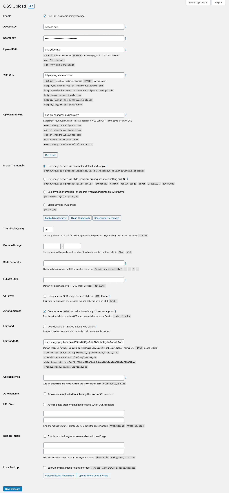
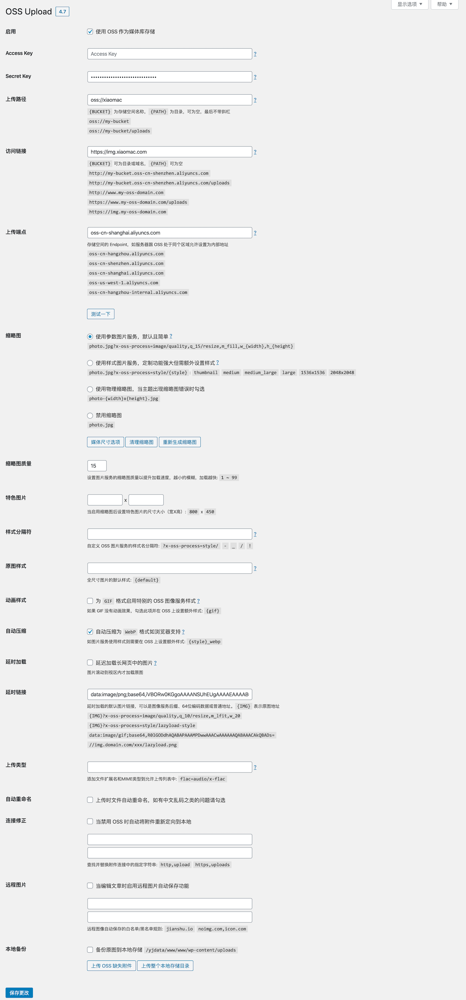

## Hi，

希望能在这里集思广益吧，自己毕竟一人一机可能会有逻辑不周考虑不全的情况。请多多指教：）

## OSS Upload

使用阿里云 OSS 作为媒体库附件存储空间，支持原创增强的 OSS 协议包装和全原生图像编辑及衍生功能。

### 功能

* 全新支持远程图片自动上传！
* 全新支持大文件自动分块上传
* 全新支持备份模式更方便切换
* 独创协议支持所有原生上传功能
* 支持修改默认的图像编辑器类
* 支持自动识别并生成WEBP格式
* 带中英文附带设置说明和示范

### 下载

https://github.com/xiaomac/oss-upload/releases

注意，下载ZIP包后，其中的目录要去掉版本号（oss-upload），我还不知道怎么去掉这个版本号。

### 更多

[https://www.xiaomac.com/oss-upload.html](https://www.xiaomac.com/oss-upload.html)

